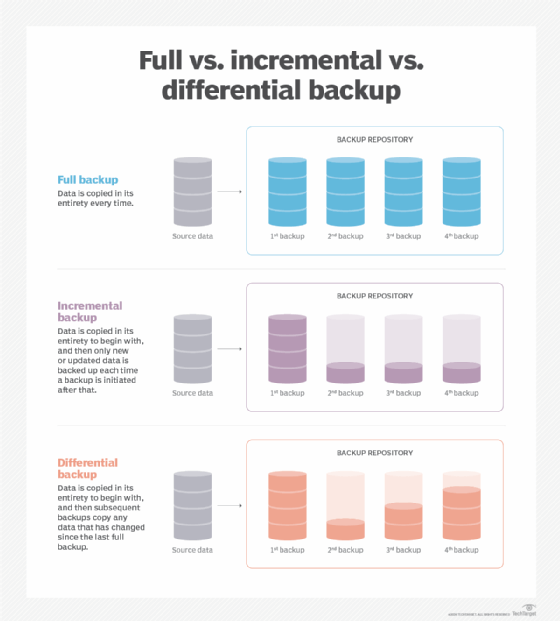
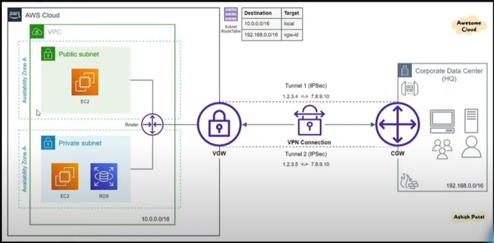

# AWS LEARNINGS

### EBS

1. EBS stands for Elastic Block Storage.
2. It acts as an extra storage to EC2 instances that we can mount on it.
3. If we create an EC2 instance, a new root volume is always created by default and it is attached to the EC2 instance. In it, the OS is installed and files related to it are stored.
4. The root volume will get deleted once the EC2 instance is terminated and the data is lost.
5. Thus, we can create a separate new EBS volume and mount it to the EC2 instance and after some config we can save our data to it.
6. This explicitly volume created can be prevented from deleting and can be mounted to the new instance in case of termination of the previous EC2 instance.
7. The EBS volumes can be of many types like General Purpose, IO1, IO2 etc based on the IOPS(Input-Output Operations Per Second) and throughput.
8. You can only increase the size of any existing volume.
9. Also, some EBS volume types can be mounted to multiple EC2 instances at the same time.
10. For mounting the EBS volume to any EC2 instance we need to create the EBS volume in the same region and availability zone as of the EC2 instance.
11. We cannot move the EBS volumes across aws regions but we can create a snapshot of the volume. This snapshot can be used to create similar EBS volume with its data in another region or availability zone
12. The snapshots taken are saved to S3 bucket. S3 is a region specific service means same S3 bucket can be accessed in different availability zones of the aws region. Thus, creating the EBS volume in another availability zone of the aws volume is easy.
13. Note: The EBS volume is an availability zone specific service.
14. The backups are taken in incremental strategy by default.  
    
15. Suppose you have taken a snapshot of 50 GB data stored presently in your volume. Now, if after one week, the data size increased to 60 GB then the new snapshot will be taken of the new 10 GB added.
16. Hence, there will be 2 snapshot, one containing 50 GB data info and the another containing 10 GB data.
17. Now, suppose the 50 GB snapshot got deleted then AWS in backend will transfer the 50 GB data to the 10 GB snapshot to prevent the data loss.
18. It means, before deleting any snapshot, the AWS will transfer its data to the immediate next snapshot to prevent data loss.
19. Note: The S3 bucket in which the sanpshot is stored is managed by AWS, we can't directly access that S3 bucket as it is not present in our AWS account directly.
20. The volume of the new EBS volume created from the snapshot should either be same or more than the volume of the EBS volume from which the sanpshot is taken.
21. The volume type can be changed while creating it from the snapshot.
22. Lifecycle manager can be used to automate the process of taking the snapshots on regular intervals or specfic time.
23. By default, if we delete a snapshot, it is deleted permanently. We can prevent this behaviour by creating a retention policy for the snaphots in `recycle bin` so that the deleted snapshots are stored in recycle bin for the set period before getting deleted properly.
24. We can copy the snapshot from one aws region to another by using the `copy snapshot` functionality.
25. We can encrypt a volume as well.
26. The snapshot of an encrypted volume is so encrypted. But we can create an encrypted snapshot from an unencrypted volume.

### AMIs

1. AMIs stands for Amazon Machine Image
2. These are images that can be used to spin up new EC2 machines with same config.
3. We can the image from an instance or from a snapshot.
4. The difference between using custom script and AMI is that if we use the custom script, the instance is first created and then the custom bash script is run on it. If we create the instance from the AMI, the instance will have the required config as soon as it gets spun up.
5. If we create an AMI from the EC2 instance, AWS first takes a snapshot of the instance and then creates an AMI from it.
6. By default, the AMIs created are private. But we can make them public to be used by anyone.
7. We can also share the AMI with any AWS account by providing its AWS account id.
8. For deleting the AMI, first deregister it. It will get deregistered from the snapshot it was created. Then, you can delete the associated snapshot.

### ELB

1. ELB stands for Elastic Load Balancer
2. ELB has multiple EC2 instances connected to it.
3. Instead of hitting the IP of the EC2 instance, we hit the Load balancer's ip and it distributes the load amoung the EC2 insatnces connected to it.
4. The ELB checks for the health of the EC2 instances connected to it using the `status` api that we generally create in our REST applications. We need to configure the health check mechanism while setting up the ELB
5. We get a DNS name after setting up the ELB. We dont get any ip address of the ELB. The DNS name can be used to access the application from any of the EC2 instances.
6. If you enable HTTP traffic from anywhere in all the EC2 instances then the EC2 instances can be accessed both from the ELB as well as outside world. Thus, we need to configure the security groups of the EC2 instances to allow HTTP traffic comming only from the ELB and not from the outside world.
7. To configure the security group of the EC2 instance for the ELB, we can set the type: HTTP, protocol: TCP and source: `<Security Group of the ELB>`. It means, suppose `sg-ELB` is the security group that you created for the ELB and attached it to the ELB. Then, while configuring the HTTP inbound rule of the security group, for the EC2 instances under the ELB, set the source of HTTP as `sg-ELB`. This config will only allow the Ec2 instances to be accessed from the ELB and not the outside world.
8. Application Load Balancer (ALB)
   1. It works on the Application Layer of the OSI model.
   2. We can create some EC2 instances that we want to keep behind the ALB. Here, we need to create some target groups and assign the created EC2 instances to any of the target group. We define some rules in the target group. The rules define the type/category of the traffic. After getting the type of traffic, the ALB reroutes the traffic to the EC2 instances of the apt target group.
   3. The ALB works on the application layer. Thus, it has all the information of the HTTP request that the client is sending to EC2 instances underneath the ALB. Suppose, we have 2 routes /home and /about in our REST application running in the EC2 instances. We want the /home requests to route to some set of EC2 instances and /about requests to another set of EC2 instances. For this, we create target groups and assign some EC2 instances to it.
   4. We can add/edit the rules, to reroute the requests for apt target group EC2 instances, in Listeners section of the ALB. There, we can set if the request has /home as the path then reroute to the traffic to the EC2 instances of a particular target group and similarly for the /about path.
   5. Some use cases are, if we have a domain `www.abc.com`. If the request comes to `www.abc.com` then we can reroute this to our front application servers/EC2 instances and if the request comes to `www.abc.com/api/` then we can reroute the request to our backend servers/EC2 instances.
   6. Similary, we can use query parameters in the request to decide the target Ec2 instances.
   7. We have the property called Group level Stickiness, which is disabled by default. Suppose I have 2 Ec2 instances (E1 and E2) under the target group. Let a client send requests, then my ALB can either send the request to E1 or E2 based on the load. Now, if the same client again requests, then again my ALB can send request to either of E1 and E2 if the Group level Stickiness is disabled. But if Group level Stickiness is enabled, then ALb will direct all the requests from same client to same EC2 instance either E1 or E2 each time. This scenerio is useful in case of stateful services where the state of the client is saved.
   8. The stickiness can be achieved by using cookies. We can use Load Balancer generated cookies as well. In this case, in request headers, you will see the aws load balancer generated cookie being attached to identify the request.
   9. Cross Zone load balancing is enabled by default in ALB. It means, if we have multiple EC2 instances from different availability zones attached to a load balancer, then the load will be distributed evently amoung all the EC2 instances irrecpective of the availability zone.
   10. If Cross zone load balancing is disabled, then the traffic will only be distributed amoung the EC2 instances that are in same availability zone as that of the load balancer.
9. Network Load Balancer (NLB)
   1. It works on the transport layer.
   2. It mainly has info about the source and destination IP address along the ports. Network load balancer does not have info about the data that is being communicated between source and destination.
   3. As NLB does not involve processing of data so it is faster than ALB.
   4. Here, the target groups are also created. We divide the target groups based on the protocol and port of the application. It means instances belonging to a target grp can be used to serve the application at port say 4569 and other EC2 instances belonging to the another target grp can can be used to server another application at port say 6708
   5. Cross zone load balancing is disabled in NLB

### ASG

1. It stands for Auto Scaling Group
2. Auto scaling is used when the actual traffic on the instances is very different from the predicted traffic. Either, the traffic is very huge and our current number of instances are not able to handle them or the traffic is very less and we have some extra instances running.
3. We can have 2 types of scaling:
   1. Vertical scaling
      1. Here, the size of the instance is increased to incorporate the increased demand
      2. If you are using a paid operating system, then its better to go with vertical scaling.
      3. If you have database running on the instance, then go with vertical scaling.
   2. Horizontal scaling
      1. Here, the number of instances under the load balancer are increased.
4. You can create a launch template for your EC2 instance. A launch template is a blueprint with some configurations that can be used to create EC2 instances with the given config. All the EC2 instances created from the template are identical.
5. We set the desired, minimum and maximum number of instances needed in the ASG. ASG will act as an orchestrator and will maintain the desired instances in the system and as soon as the traffic increases, it starts increasing the number of instances.
6. As soon as the ASG is deleted, the instances created by the ASG will also gets deleted from the system.
7. We can have the following types of scaling:
   1. Scheduled actions
      1. This is used when you know the events in the future where the load will be high and more instances will be needed.
      2. The event can be on specific date and time or periodic as well.
   2. Predictive actions
      1. This can be used with aws' predictive algo where through the past data, aws analys when and how many new instances will be required to meet the potential demand.
   3. Dynamic actions
      1. It has the follwoing scaling policies:
         1. Simple scaling:-
            1. Here, we need to create a cloudwatch alarm for anything like CPU utilization etc. When the alarm is triggered, based on the config new instance will gets created
            2. We can either increase or decrease the number of instances
         2. Step scaling
            1. It is similar to Simple scaling except here we can config increasing and decreasing of instances based on multiple cloudwatch alarms
         3. Target Tracking scaling
            1. Here, we dont need to create cloudwatch alarm manually. It also uses the cloudwatch at the backend but we only need to provide the condidtion which will trigged the scaling on instances like say, when average CPU utlization of all the instances becomes more than 50% then start creating new instances
8. When you create the ASG for a load balancer, it asks for info about existing target grp or creating target grp. After this, the addition or removing of scaled instances into the target group will be taken care by the AWS itself.

### IAM

1. Identity Access Management
2. IAM is a global service. It means its config will remain available in all the avalibility zones.
3. It is used to give specific roles and permission to users. We grant some aws services permissions to the user so that the user can perform some actions on them only.
4. We attach policies to the users. A policy is a document in which the aws services and their permissions are written.
5. We can create groups with some policies attached to it. Later, we can add/remove users from it.
6. Suppose, there are 2 policies:- S3 full access and S3 no access. Both of these are attached to a user. Then, the user will not be able to access the S3. In AWS Identity and Access Management (IAM), when a user is associated with multiple groups, the permissions are cumulative. This means that if you attach a user to two groups—one with permissions to read and write in Amazon S3, and another with explicit denials to read and write in S3—the user will ultimately be denied those permissions. In IAM, explicit denials take precedence over permissions granted. This is known as the "deny overrides" principle. So, if any group the user belongs to denies a certain permission, even if the other groups grant that permission, the denial will take precedence and the user will be denied access. In your scenario:
   1. Group 1 grants read and write permissions to S3.
   2. Group 2 denies read and write permissions to S3.
      If you attach both groups to a user, the user will not have permissions to read and write in S3. The explicit denial from Group 2 will override the permissions from Group 1. So, the user will essentially have the least permissive set of permissions across all the groups they are associated with. In this case, the user would not be able to perform any S3 actions due to the explicit denial in Group 2.
7. If you copy policies from a user to another. Then, if the source user is a member of a group and you copy its permissions to the other user, then the other user will also become the member of the group that the source user is.
8. Roles in AWS:
   1. Roles are attached to an AWS resource.
   2. The role can give access to an aws resource to access another aws resource mentioned in the role policy.
   3. Like, we can create a role with a policy to access the S3 and assign that role to EC2 instance or lambda. Thus, now we can access the S3 from our EC2 instances or lambda.
   4. Similary, we can assign the role to access the secrets manager to our lambdas.
9. Cloudshell
   1. It is an AWS cli that can be accessed on the web from the aws account.
   2. The account through which the cloudshell is accessed will already be configured in the cloushell
10. Thus, we can access the AWS services through 3 ways:
    1. Configure the aws cli in our local system
       1. Install aws cli from web
       2. In terminal, run `aws configure --profile <name>`
       3. This will ask for your secrets
       4. then using, `aws help` you can further access the aws services like S3, ec2 etc
    2. Providing specific service role to EC2 and lambda
       1. The role can be assigned to EC2 instance and then the aws services can be accessed by installing the aws cli in the ec2 instance
       2. We dont have to configure the credential as the role is assigned to the Ec2 instance
    3. Using Cloudshell
       1. We dont need to install anything as this can be accessed from the aws console.

### S3

1. S3 stands for Simple Storage Service
2. Here, we can storage our data.
3. This is an aws core service.
4. The bucket can be created in a region. The bucket name should be unique across all the buckets present in aws.
5. The files uploaded in S3 bucket are refered to as objects.
6. S3 bucket dont support creating folders. Suppose you created a folder, with name f1, and added a file file1.txt in it. Then, the folder names will only be added as prefix to the file name and hence the final name will be f1/file1.txt Here, `f1/` is the prefix for file `file1.txt`
7. Versioning can be enabled to prevent losing of an object if it is overridden by another object with the same name. If versioning is enabled on the bucket and some object is deleted by mistake then you can retrieve it by foloowing steps:
   1. First enable the show versions toggle
   2. The deleted file will have a type as `Delete marker`
   3. Delete this file with type `Delete marker` and your mistakenly deleted file will be retrieved.
8. If you have enabled versioning for a bucket then you can't disable it. you can only suspend the versioning. It means the files, which were uploaded when the versioning was enabled, will still show versions after the versioning suspension. But the newly uploaded files will not have any versions.
9. You can use S3 to serve static pages of your website. It means the pages will not have any api calls etc, just a file containing html, css and js. You need to enable the static website hosting setting in the S3 bucket.
10. We need to make both the bucket and the objects in the bucket public for them to be accessed publically.
11. In case of static hosting, we can redirect one bucket to another. It means suppose we have redirection from bucketA to bucketB with both having static website hosting enabled, then if we try to access the bucketA through its hostname, it will redirect us to the bucketB's hostname.
12. We can set redirection rules as well in static website hosting buckets.
13. S3 Accelaration
    1. Suppose you have a bucket in aws virginia region and you live in India, you want to upload some files to your bucket.
    2. Normally, it will take a lot of time as you will have to upload you file directly to the bucket which is very far from your location
    3. S3 accelaration can be enabled to cut short the time taken to upload the file.
    4. In aws, we have lots of edge locations like mumbai, hyderabad, delhi etc in ap-south-1.
    5. In S3 accelaration, say you are in India, what we do is we upload the file to our nearest edge location and then aws itself will transfer it, using its own network, to your bucket in virginia. AWS is smart enough to know if direct uploading will be faster or accelarated uploading and uses the faster one.
14. Same Region Replication (SRR) and Cross Region Replication(CRR)
    1. The objects in a bucket are copied to mutiple availability zones by default for fault tolerance
    2. When the object is copied in the same region, we call it SRR
    3. When the object is copied in multiple regions, we call it CRR
    4. You need to set the replication rules in a bucket, where you will be defining the source and the destination bucket. The destination bucket will be the one where the backup of the source bucket will be kept. The dest bucket may be in same region or other.
    5. Note, the replication will not replicate the delete marker until explicitly checked.
15. S3 storage classes
    1. We have multiple storage classes based on the frequency of object retrieval, availability of object.
    2. We can select the storage classes only at the object level not at the bucket level. It means while uploading the object in S3 we can select what storage class like standard, glacier etc the object belongs. The storage class then will decide the fequency, speed etc of the object retrieval.
16. S3 lifecycle management
    1. We can define the lifecyle of an object present in our bucket using the lifecyle rules.
    2. It means suppose an object is there which belongs to the S3 standard storage class. Now, you want the object to move to S3 Glacier storage class after some time, say 30 days and after 90 days you want to delete the object. You can do all this my setting up the lifecycle rules in bucket.
17. CORS:
    1. Suppose, you have a website www.web1.com and you have some images, html files etc stored in S3 bucket.
    2. Now, you want to use the resources of S3 bucket into your website. But as you can see the origin of your website will be www.web1.com and the origin of S3 will be, lets say, s3:youbucket.aws.com.
    3. Now since the origin of both the things are different, you cant use the resources of s3 directly into the web1.com.
    4. For this to work, you need to enable CORS and whitelist the web1.com url in your S3 config so that the web1.com can access the content of S3 bucket.
    5. Note, the CORS by default blocks the external websites to access your website's data, means only the requests from same domain will be catered and rest will be denied.
    6. In case of S3 say there are 2 buckets, bucket1 and bucket2. Both the buckets have static website hosting enabled. Now, say you have your index.html file present in bucket1 and the other file say content.html in bucket2. Suppose, in the index.html, we are trying to access the content.html using jquery.
    7. Now, since the CORS policy is not set by default so you are going to get CORS error. For, bucket1 to content of bucket2, you need to enable/whitelist the bucket1 in bucket2's CORS policy.
18. Presigned URLs
    1. Suppose you have a S3 object which you want to share with someone outside your org. You can't make the object public as that can make the object accessible to anybody.
    2. Presigned urls are urls which allow someone to access any object for a duration of time and after that the url will get expired and no one will be able to access the object with that url.
    3. In AWS, select the object and go to object actions. After that select generate presigned url with a time limit.
    4. This helps in sharing object with external people without making it public.
19. S3 encryption
    1. You can encrypt the bucket objects either at the client side (at the application level, before storing to S3) or at the server side (means at the AWS side)
    2. For server side encryption, you can use either S3 managed encryption key or key from Aws Key Managment Service.
    3. You can have a particular encryption mechanism at the bucket level. Also, you can override the bucket level encrytion mechanism for any object with a different encryption mechanism.

### Cloudfront

1. Suppose you have a server in US and you are in India, say Moradabad. Now, you want to access a webpage hosted on the server. Now, ideally you should directly request the US server and fetch the webpage. But since the distance between the client and the server is too large, then the request will take some time to fulfill.
2. As we know, there are many aws edge location. Now, suppose there is a edge location with aws servers in Delhi, India and I am in Moradabad. Now, if I want to request a webpage from US server, I will make a request to my nearest edge location i.e Delhi. The request will reach the Delhi servers and then AWS will use its own network to communicate the Delhi location to the US location for the requested webpage. Since, AWS is using its own network, the request turnaround time will be very less. Then, after retrieving the webpage in Delhi location, AWS will send the page to client and also keep a copy of the webpage for itself in case of another request for the same page. The webpage will be stored in AWS cloudfront.
3. Cloudfront is like a cache which can store webpages, files etc. at a edge location
4. Cloudfront can store dynmic as well as static content.
5. Cloudfront keeps sending the response back to the client as soon as it starting getting response from the server. It means if a file is requested by user which is very large in size, Cloudfront will keep sending the file to the user for download as soon as the first bit of the file is recieved at the cloudfront(at the edge location) from server.
6. Thus, cloudfront can be used for streaming as well because the client will request for the data to an edge location, rest is taken care by the AWS network to ask for the data from far server and then sending the data back to client as soon as it is recieved at the edge location.
7. Even if the server is sending the data (large data) in multiple packages/chunks, the cloudfront will send them to the user as soon as it recieves them so that the latency can be reduced. Thus, cloudfront is good for streaming purpose as well.
8. Once you setup a cloudfront configuration, it will be deployed at all the aws edge locations.
9. Also, while creating the cloudfront config, you can add a custom header to the request going from cloudfront to your server. It means the client will request for webpage/file to the nearest cloudfront and then the cloudfront will add that custom header in the request and send it to the server. The custom header can be checked at the server to know if the request is comming from the cloudfront or not by cross checking the custom header that you added. This can be used to filter out the request comming from cloudfront.
10. If you have updated the webpage at your server but your cloudfront is still showing old webpage then you can create cloudfront invalidations and invalidate the data for the path you want. Next time you fetch the webpage, it will be an updated one.
11. Enabling only cloudfront to access your Load Balancer or EC2 instance:
    1. If you want nobody except the cloudfront to access your Load balancer and EC2 instance then you can do this by enabling the IPs that are allocated to cloudfront only in the load balancer/EC2 instance's security group.
    2. AWS maintains some list of IPs itself like the list of IPs of cloudfront
    3. You can get the cloudfront list by Going to `VPC ---> Managed Prefix lists ---> amazon global cloudfront list`
    4. Copy the id of the cloudfront list
    5. Now, add the id to the source http and https in the security group of the load balancer or EC2 instance
    6. After this, the load balancer or EC2 instance will only get hit from cloudfront.
12. You can also access a private S3 bucket's object using cloudfront. All you need is to create a cloudfront distribution for that S3 bucket and change policy of the S3 bucket to enable cloudfront to access the objects of the bucket.
13. Cloudfront path based routing
    1. Suppose you have a requirement to create a cloudfront distribution where if /images path is hit, we need to get retreive data from S3 and if /web is hit, we need to access our EC2 instance.
    2. You can do this my adding multiple cloudfront origins with the paths mentioned above.
    3. At the time of creation of cloudfront distribution, you can only add one origin. But after its deployment, you can add multiple origins like S3, EC2 etc.
    4. After this, go to behaviours in that cloudfront distribution, add the path and the origin you want to call for that path.
    5. This will make the desired changes.
14. You can also set a custom error page for different error codes like 404, 500 etc.
15. You can also put geographic restrictions like allowing or blocking access to the cloudfront from any number of countries.
16. Note: any changes to the cloudfront config will be deployed to all the edge locations so things might take time to deploy.
17. Usages of cloudfront
    1. You can only allow request from cloudfront to call apis by adding custom header to the req and then checking that req header in a middleware.
    2. You can also set the TTL for api response in cloudfront by adding `cache-control` response header from the server in the response.
    3. Suppose, you have the following 2 urls hit one after the other:
       1. `cloudfront-url.aws.com/user?page=1&size=5`
       2. `cloudfront-url.aws.com/user?page=2&size=6`
       3. It means we have query params along with path.
       4. Cloundfront is a cache and by default it puts only the path as key and the response as value. It means it does not take the query params into the consideration of key.
       5. Thus, both the above mentioned urls will return the same response as the path is same. The first one will be a cache miss and other one will be a cache hit. This is because the query params in not taken into consideration in the cache key hence both the requests will be considered as same.
       6. We can enable the query params consideration by enabling Query strings setting in cache policy. After this, the query params will also be considered in the cache key and hence the response will be different for the above requests
       7. Similary, we can enable header and cookies as the part of the key in cache. This can be helpful for authorized users.

### Amazon VPC

1. VPC stands for Virtual Private Cloud. This is AWS' networking service
2. All the services that you deploy need to communicate with each other thus there is need for networking
3. VPC has the scope in a region only.
4. Creating a VPC
   1. We need to provide range of private IPs that will be used in the VPC
   2. The network created using VPC is a private network so private IPs are needed. You can search on the internet about private IP range
   3. You need to provide the IPv4 CIDR. Now, suppose you have chosen the private network intial IP as 192.168.0.0 , now you thought you are going to have not more that 2^16 servers for your services. Then what you can do is you can put the 192.168 as static prefix for the server IPs and have the variable IP from 0.0 to 255.255, Hence the full range of IPs for your servers will be 192.168.0.0 to 192.168.255.255. Since the first 16 bits of your private IPs will be static so the CIDR for you VPC will be `192.168.0.0/16`
   4. Here above the network id will be 192.168 since this is static
   5. The created VPC will be available in all the availability zones under the region
5. Subnets
   1. We can divide the bigger network, where devices can have IPs ranging from 192.168.0.0 to 192.168.255.255, into smaller subnetworks or subnets.
   2. In a college, we have multiple networks may be divided based on departments. Although, the college will have a VPC but there can be multiple subnets for multiple departments.
   3. Devices connected to a subnet can communicate with each other seemlessly
   4. Now, suppose we want to create 4 subnets from the above VPC and lets have their IP ranges as follows:
      1. Subnet 1: 192.168.1.0 - 192.168.1.255, thus IPv4 CIDR will be 192.168.1.0/24 since first 24 bits are static for the subnet
      2. Subnet 2: 192.168.2.0 - 192.168.2.255, thus IPv4 CIDR will be 192.168.2.0/24 since first 24 bits are static for the subnet
      3. Subnet 3: 192.168.3.0 - 192.168.3.255, thus IPv4 CIDR will be 192.168.3.0/24 since first 24 bits are static for the subnet
      4. Subnet 4: 192.168.4.0 - 192.168.4.255, thus IPv4 CIDR will be 192.168.4.0/24 since first 24 bits are static for the subnet
   5. Subnet's scope is in a availability zone only
6. Note: Whenever we create a security group, we select a VPC. Now if we create another VPC and use it for our instances, we will not get that security group as option while attaching it to the EC2 instance because the security group is attached to some other VPC.
7. If you associate you vpc or subnets to your servers, then your servers will be able to communicate with each other but you will not be to access them using CLI, API etc because there is no internet access to the vpc.
8. To provide the internet access to your VPC, you need to create an `internet gateway` and attach it to you VPC.
9. Once you create a VPC, a routing table gets created and get attached to it. Routing table defines what traffic should be allowed and disallowed and what IPs are local and what are for the internet. For our setting, any machine with the private IP as 192.168.0.0 - 192.168.255.255 will be considered as local and its traffic will be local used to communicate with other server in the same IP range.
10. For us to access the servers, attached to our VPC, through internet, we need to attach IP range 0.0.0.0/0 with target as Internet gateway, that we created above, to the routing table attached to our VPC.
11. As we have created 4 subnets in our VPC and by default a routing table gets attached to our VPC, so the same routing table will gets attached to all the 4 subnets. It means any changes in the routing table will be applicable to all the subnets. It means if internet access is introduced in the routing table then all the subnets will have internet access.
12. The subnet which has internet access is called Public subnet and which does not have internet access is called Private subnet.
13. We can have our EC2 instances, where we have our application running, in the public subnet and the intances, where we have databases, in the private subnet so the application servers can be accessed by the internet but the database server can only be accessed by the application instances which are part of the same VPC and has the private ip range between 192.168.0.0 to 192.168.255.255.
14. In private subnet, the servers, with the defined IP range in the VPC, can communicate with other and nobody from outside.
15. Create public subnet and private subnet with a VPC:
    1. There is one default routing table attached to all the subnets under a VPC and it does not have public internet access enabled by default
    2. You can create a new routing table under the same VPC and attach some of the subnets, which you wanna keep private, to the routine table. The newly created routine table will not have internet access by default.
    3. You can provide the internet access to the default created routing table so the subnets that are still attached to it will get internet access and become member of public subnets.
    4. In this way, we can create public and private subnets within the same VPC
16. The instances created under any public subnet can be accessed by internet and the instances created under the private subnet will not be accessed by internet but only by the servers belonging to the subnets under the VPC
17. You can also put your application server in private subnet and to access the application, you can create a proxy server in the public subnet. So the user will only be able to request your proxy and then the proxy will forward the request to application server as both belong to the same VPC.
18. Suppose, you have 2 subnets, S1-public and S2-private which are public and private respectively. Now, say you have 2 instances I1 and I2 connected to S1-public and S2-private respectively. If you try to ssh the I1, you will be able to do it since the I1 has the internet access and if you try to ssh the I2, you will not be able to do it as it does not have internet access. Now, you want to install something in the I2 using terminal but from your system you wont be able to do it. So what you can do is, first ssh into I1 and from I1, ssh into I2. I1 and I2 will be able to communicate with each other as both of them belong to the same VPC. After that, you will be able to install things in I2. Here, I1 acted as a `jump server` as it is here used to access the I2.
19. Note: Even after ssh to I2 from I1, you wont be able to access internet through I2 as it is part of private subnet and does not have access to internet.
20. To provide the internet access to I2, we can use the following methods
    1. Using NAT (Network Access Translation)
       1. We have multiple devices connected to our router. In this case, the router will have a public IP and all the devices connected to it will get private IPs.
       2. Whenever the connected device need to access the internet, it will use the router's public IP. The reponse will be returned to router and then the router will send the response to the private IP of the requesting device.
       3. Thus, to provide internet access to I2, we will create a special NAT instance. The private I2 will use the NAT instance to access the internet. This nat EC2 instance will be created using a NAT AMI. Also, this instance will be created in same VPC and public subnet.
       4. We need to attach an elastic IP to the NAT instance
       5. After this, we need to go the routing table of private subnet and attach the destination `0.0.0.0/0` to the NAT EC2 instance target. This will forward all the traffic, that does not fit the 192.168.0.0/16 CIDR, to the NAT EC2 instance.
       6. Also, suppose the I2 has a public IP of 1.2.3.4 and the NAT instances elastic public IP is 5.6.7.8. Now, after following the above steps, I2 requests for google.com and this will be forwarded to the NAT instance and it will forward it to the google.com. Since, the request is comming from IP 1.2.3.4 and the response will also be sent back to 1.2.3.4. But here, since the request was forwarded by NAT instance with IP 5.6.7.8, so it will decline the reposne comming from google.com saying the response is for IP 1.2.3.4 but my IP is 5.6.7.8.
       7. To solve this, we need to go to the NAT EC2 instance, then `networking --> Change source/destination check --> Stop it`. This will prevent the NAT instance to check if the incomming traffic is for its IP or not. It will just accept it.
       8. After all this, finally, your instance I2, part of the private subnet, will get the internet access.
       9. This method is generally not recommended as we have to maintain the NAT instance and also it will act as a single point of failure.
    2. NAT gateway
       1. This is a aws managed service.
       2. You can create a NAT gateway in the VPC of I2 and public subnet.
       3. Again, attach the NAT gateway to the routing table of private subnet againt the 0.0.0.0/0 source.
       4. After, this your private instance will get the internet access
21. NACL
    1. It stands for Network Access Control List
    2. `End user request --> NACL firewall --> Security Group --> Server EC2 instances`
    3. The NACL is the first firewall the request encounters then its the security group and then it will hit the servers
    4. Now, if we want to deny some IPs to make request, we can't do it in security group as it only has the allow mechanism. We can do this denial in NACL.
    5. Each VPC has a NACL attached to it, we can configure that.
    6. In each NACL, we have rule numbers. Lower the rule number, Higher the priority. Thus, all the denial rules should have low rule numbers to prioritize them first.
22. Security group vs NACL:
    1. SGs are stateful and NACL is stateless means we only config inbound rules in security groups and aws automatically config the outbound rules but in NACL, we need to config both.
    2. SG is at instance level and NACL is at the subnet level
    3. We can only config allow in SG while in NACL, we can config both Allow and Deny
23. VPC Peering
    1. Suppose there are 2 instances I1 and I2 in different VPCs, say VPC1 and VPC2. Both I1 and I2 are in public subnet.
    2. If we want these instances to connect with each other, we can do this by using their public IPs not private IPs
    3. VPC peering can be used to connect instances using their private IPs. The instances can be in:
       1. 2 different VPCs
       2. 2 different regions
       3. 2 different AWS accounts
    4. Note: while creating the VPC peering connections for 2 VPCs, the private IP CIDRs of both the VPCs should not overlap.
    5. After creating the VPC peering connection, you need to add the CIDR's of both VPCs into each others route tables with target as the created peering connections
24. Transit Gateway
    1. Suppose you have multiple VPCs and you want to connect them all, means the instances in all the VPCs will be able to communicate with each other using private IPs
    2. AWS transit gateway is a aws service which can connect to multiple VPCs like star topology. All the VPC connected to the transit gateway will allow all the instances created in them to communicate with each other.
    3. You can also communicate your data centers, using Site to Site VPN, with Transit gateway.
    4. First you need to create a transit gateway.
    5. Then, you need to create transit gateway attachments for each VPC you want to connect to the transit gateway.
    6. After this, a new route table will be attached to the transit gateway stating the source IP CIDRs and the destination as the respective VPCs
    7. Now, you have to go to the route table of all the VPCs, that are connected to the transit gateway, and add the CIDR's of other VPCs as source and the transit gateway attachment as the target. So, any traffic for the private IP range in the CIDRs will be routed to transit gateway and then it will be routed to the destination VPC
25. VPC Endpoint
    1. Suppose, there are 2 persons, P1 and P2, sitting beside each other and connected to same router, Rtr
    2. Let say, P1 sends a whatsapp message to P2. The message flow will look like:
       1. `P1 --> Rtr --> Whatsapp server --> Rtr --> P2`
       2. Here, even tough both P1 and P2 are sitting besides each other still the message has to go the outerworld through the internet and then gets tranfered to the destination
    3. Similarly, when you have your application server running and the application uploads some files on S3 then this task has to be performed through public network although both the services, application server and S3, are in AWS infra.
    4. Thus, for private communication between different aws services, we use VPC endpoints so we dont have to go through public channels for communication.
    5. You need to create a vpc endpoint with S3 as the aws service and your instance's VPC. The services can have 2 types Gateway and Interface.
    6. In Gateway type, the route table attached to your VPC will get modified. A Prefix list, containing the IPs of all the S3 servers, will be added as destination and a VPC will be added as target. Thus, any request, the application server makes, trying to access the S3 server will be routed to the target VPC where the required S3 bucket can be accessed. The target VPC will have all the S3 buckets under it.
    7. In interface, the settings will be attached to subnet. An interface will gets attached to a security group in this case. That network will be used for private communication between aws services. This is a more costly approach as the data transfer cost through the interface has to be paid.
26. AWS Site to Site VPN
    1. VPN creates a tunnel between the client and the server. No thrid party can check the packets that the client and server are exchanging between them.
    2. Some orgs put their application servers etc on AWS and they put their data centers on Premise may be due to trust issues.
    3. Now, if they want their application servers to communicate with their data centers, they want to do it through secured network, say VPN.
    4. What happens is the client installs a client gateway (VPN server) on its premise and at aws side, install VGW (Virtual Gateway) on the VPC or transit gateway (connected to multiple VPCs). The VGW and Client gateway will communicate with each other.  
       
    5. VGW saves us from installing VPN client on each EC2 instance.
    6. The route table will be updated as such the traffic whose destination IPs CIDR matches the one present in data center that traffic will be routed to VGW which will forward that to the client gateway securely. Thus, your data centers will be able to communicate with your aws infra.
27. Egress only internet gateway
    1. This is similar to NAT gateway.
    2. But this only supports IPv6
    3. Thus, if you want to communicate using IPv4 then use NAT gateway and for IPv6 use Egress only

### Route 53

1. This is a fully managed DNS service
2. Top Level Domains (TLDs) are .com, .in, .com.au etc
3. Route 53 is a domain registrar as well means you can buy domain from here as well.
4. Registering the domain:
   1. You need to go to register domain in aws and find which domain is available.
   2. After successful payment, you can see you domain and a hosted zone
5. Hosted Zone:
   1. After buying the domain name, we need to configure it so that people hitting the domain land on the desired website. All the configurations needs to be done in hosted zone.
   2. One hosted zone is created by default after buying the domain.
   3. If you create new hosted zones then you have to pay for it
   4. In a hosted zone, you will have 2 records created by default
      1. SOA record
         1. It stands for Start Of Authority. It contains all the info about your domain.
      2. NS record
         1. It stands for Name Server
         2. Any DNS request follows this path before getting resolved `www.example.com --> DNS Resolver --> Root level server --> TLD server --> Name server`
         3. Name Server aka Authoritive Name Server knows the server IP where the request needs to go.
         4. The name server has all the info related to the domain name
         5. Route 53 provides you 4 name servers by default for fault tolerance
   5. Creating records
      1. Records can be of different types. Some of them are as follows
         1. A record
            1. It tells the IPv4 address where the request will go which came at your domain
         2. AAAA record
            1. It is similar to A record but it deals which IPv6
         3. CNAME record
            1. It is used to redirect traffic comming to your domain to another url. For example, if you create a load balancer, you dont get any IP address. Load balancer gives you a url. Thus, if you want to route the request to load balancer, you can create a CNAME record.
         4. MX record
            1. It tells if any mail comes to the domain then the exchange host or mail server, where the mail will be routed, will be configured here.
         5. TXT record
            1. you can set a subdomain for user verifications here.
   6. Subdomain
      1. Suppose you hit the following domain: `http://abc.xyz.com`, the web browser will append a `.` at the end automatically behind the scene, means you request will go like `http://abc.xyz.com.`
      2. The last `.` is the root domain, `.com` is the TLD, `xyz` is the domain and `abc` is the subdomain.
      3. We can create multiple subdomains of a single domain
   7. CNAME vs Alias
      1. CNAME can't be used for root domain. It can only be used with subdomains
      2. If you want to use a url say from s3 bucket at you root domain, which is hosting your static website, first rename the s3 bucket to the same name of your domain and the create a record with alias and select the bucket in it.
      3. Alias can point to any aws resources and it also works on both root domain and subdomain level.
      4. Try to use alias more and more instead of CNAME as alias is free but rest type of records are not free.
   8. TXT Record
      1. Lets create a subdomain `acme.abc.com` and select the TXT as record type and set any value for it.
      2. To access the value that you stored in the txt record, in terminal type `nslookup -type=TXT acme.abc.com`. It will return the string.
      3. This is used to verify sometimes that the website belongs to you.
      4. The usecase is when you want ssl certificate for your website, the certificate provider might ask you to create a acme subdomain and TXT record and set the value to a value provided by the certificate provider. It will run the command on its server and checks if the website really belongs to you or not. This is also called acme challenge.
   9. Health checks
      1. We can create health checks to monitor our EC2 instances (using their IPs) etc. We can check if our services are up and running or not.
      2. We can also create health check which monitors other health checks on individual services
   10. Routing policies
       1. Simple Routing Policy
          1. We can define mutiple IP addresses in it and the user will get all the defined IP addresses when run `nslookup`
          2. User can now send request to any of the IP addresses
          3. Simple routing policy does not provide health check option. Thus, even if some IP is down, the user will still get the defined IP list
       2. Weighted Routing Policy
          1. We can use this policy to partially rerouting some of the traffic to new service deployments say 10% of the traffic will be served new service and then we will increase the percentage once everthing is fine.
          2. Here, we can divide the traffic to go to different IP addresses
          3. For example, we can set the 60% of the traffic to go to an IP address and 40% to go to some other IP address whenever your domain is hit.
          4. We can also provide health checks to the IPs. If any of the health check fails, it will redistribute the traffic to remaining healthy IPs
       3. Geolocation Routing policy
          1. We can divide the traffic based on the location from which it is comming
          2. Suppose, you have applications returning resposne in 3 different languages like Hindi, English and Spanish. Each running on a separate server with an IP attached to it.
          3. In this routing policy, you can divide the servers based on the location of the request like say from India, the request will be catered by Hindi server etc.
             1. Hindi -- India
             2. Spanish -- Spain
             3. English -- Rest of the world
          4. You need to set a default location as well while setting up this routing. The requests comming from rest of the world except India and Spain, from above example, will be served the default IP address.
       4. Latency Based Routing
          1. Suppose you have deployed your application in multiple AWS regions, Latency based routing makes sure that the user trying to reach your website will be routed to the server where the user will get minimum latency fetching the website.
          2. It is different from geo based routing as here the user will route to the nearest server but in geo based, we explicitly tell where to connect based on the user's location
       5. Failover routing policy
          1. In it, we provide info about a primary and a secondary server.
          2. Until the primary server is healthy, the secondary server will not get any requests. If the primary server becomes unhealthy, the secondary server starts getting requests and server them
       6. Multivalue Answer routing policy
          1. It is similar to simple routing where we can give multiple IP addresses and all of them will be returned to the requesting user.
          2. The difference is we can put healthchecks for all the IP addresses, which was missing in simple routing, and only the healthy ones will be returned to the user.
       7. IP based routing policy
          1. Here, we first create a CIDR collection stating some IP CIDR like `18.234.0.0/16`
          2. In IP based routing, we can set what IP to return when someone hit our website.
          3. Like, we can set, say 1.1.1.1 to return if we get any hit from the IP in CIDR `18.234.0.0/16` and 2.2.2.2 from rest of the IPs
          4. This can be used to mask the IP so hackers cannot know our exact IP. We can set the policy such that if we get hit from our own servers in a VPC, we will return actual IPs and when we get hit from outside world, we will return a masked IP say 1.1.1.1
   11. Traffic Policy
       1. This is a UI representation of our policies, servers, healthchecks etc.
       2. We can use it to create routing infra for complex scenarios
   12. DNS firewall
       1. We can block some websites that our aws servers like EC2 instances try to access. Those websites may be malicious and you dont want to compromise your instances.
       2. Thus we can block websites in our aws network
       3. This is a part of VPC service
       4. We can make our own list of blocked websites or we can use aws configured and maintained lists
       5. You can attach the list to your VPC and after that all the servers under the VPC will not be able to access the websites mentioned in the block list.
   13. Private Hosted zone
       1. Companies has some websites which can be accessed only in company premises or company VPN
       2. When EC2 instance makes request for a website, the DNS resolver, inside the VPC, first checks if the website is hosted in your private zone or not, then it check on the amazon DNS server and then goes to the outer world for resolving the address
       3. Create Hosted zone
          1. You can create a domain for your website that can be accessed only in your private hosted zone like `domain.internal.com`
          2. You need to attach it to your VPC and create the hosted zone
          3. Now, go to the `domain.internal.com` hosted zone and set a routing policy to it.
       4. After the above setup, if you try to access the website from any server in that VPC, the DNS query will be resolved.
       5. You can also use VPN and the DNS query will be resolved.
       6. You can also attach the private hosted zone to multiple VPCs
       7. Note: With the above config, the private hosted website' dns, hosted in a VPC, will only be resolved if it gets request from server that belongs to the VPC.
   14. Hybrid DNS
       1. Suppose a company has a on premise data center with a DNS resolver and aws infra with route 53 DNS resolver in the VPC.
       2. You have a private hosted zone in aws with some internal company websites. you also have a site to site VPN enabled between AWS and your data center.
       3. Now, you want to access the private websites from your data center.
       4. Once you try to access the private website, the request will first go to your inhouse DNS resolver and then it will go to the outer world and since the website is privately hosted, and can only be resolved by the aws DNS resolver in that VPC, you will be not be able to resolve it.
       5. You need to make some mechanism so that your data center can use the VPC's DNS resolver to resolve the IP address of the private website.
       6. You can do this by creating DNS inbound endpoint in AWS that will allow outside traffic, from your data center, to query the DNS resolver of the private hosted zone.
       7. After creating the inbound endpoint, you will get some IPs that can be used to access the VPC's DNS resolver.
       8. Now, you can use the given IPs to point the DNS resolver.
       9. Similarly, DNS outbound rules can be created to resolve a private website hosted in someother VPC that an EC2 instance is trying to access.

### Amazon RDS (Relational Database Service)

1. RDS is a servive managed by AWS
2. We can select any of the databases available in the market like mariadb, mysql, postgres etc while creating database in RDS
3. After creating the database, you will get an endpoint and port number which can be used to access the database. Also, verify if the database port is enabled in the security group attached to the database
4. The database is created in single region
5. Read Replicas
   1. These are created to perform read operations on the database so the reading load does not go to the master database which is doing both read and write operations
   2. We can create read replica of the database by simple selecting the database and going to the actions
   3. We can enable cross region replication as well while creating read replica
   4. The read replicas are updated asynchronously with the new content in the master database.
6. Multi AZ in RDS
   1. If the master database is only in one availability zone and if that AZ gets down then you will not be able to do any operations on the database
   2. Thus, while creating the database, we can config Multi AZ properties for making the database highly available
   3. Standby instance
      1. This property will create another replica of the master database and syncs data asynchronously with it
      2. If the master database goes down, the replica will replace the master db instantly.
7. RDS Proxy
   1. Whenever a sql query is run after connecting your computer and RDS, the following operations are performed between application server(mysql server running on our PC) and database:
      1. First, a connection is opened between your machine and RDS. OS opens a network socket between machine and RDS
      2. Authentication is done of the user running the query
      3. After authentication, query is run and the output is returned
      4. Then the network socket gets closed and the connection between the machine and RDS also closes
   2. Now, suppose the number of requests increases on your server and ultimatley increases database queries, then the CPU, memory utlization increases.
   3. We can create a proxy between the server and database. The proxy will remain connected to database.
   4. The proxy will maintain the connection with database and also will keep some connections open to be utilized by application server to query the database thus speedup the process
   5. The proxy will have some connection open in connection pool and will reuse them to reduce the time of creating a new application
   6. After creating the proxy, you need to use the proxy url to query the database from your application server.
   7. You can also limit the database access to proxy by configuring the security group of the database. After this, no from outside can directly access the database
8. Amazon Aurora DB
   1. Aurora database engine are developed by aws itself
   2. This database is 3x faster than postgres and 5x faster than mysql
   3. It is compatible with both SQL and Postgres commands
   4. For other databases like mysql, mariadb etc, we ourselves have to decide the memory to be allocated for the DB which can be extended by you have monitor it yourself.
   5. Aurora database will start at 10 GB initially and keep on extending/scaling the storage automatically as soon as the space starts filling.
   6. Whenever Aurora DB is created, 6 copies of the data inside will be created and stored in mutliple availability zones. If any of the AZ gets down, the data can be retrieved from other AZs.
   7. As the data is already stored in multiple AZs, the creation of read replicas is faster as aws only has to config the read replica and the data can be fetched from the copy stored in that AZ
   8. Maximum 16 read replicas can be created in different regions
   9. It also supports read replica forwarding means if any write request comes to your read replica then that request will be forwarded to your master DB
   10. Aurora DB is by default multi AZ enabled. Read replica can be promoted to primary or master DB incase of master DB failure
   11. Here, master and read replica have a common shared storage volume to read and write data.
   12. In Aurora, we have multiple endpoints above the reader and writer/master DB:
       1. Writer endpoint
          1. This endpoint will always point to the primary database. In case of failure of master/primary DB and promotion of any read replica as new master, the write endpoint will remain the same but it will start pointing the IP of the new master
       2. Reader endpoint
          1. This endpoint will point of the read replicas and also performs load balancing for faster read operations
       3. Custom endpoints
          1. We can create custom endpoint if we have mutiple readers and we want the custom endpoint to connect to some selected read replicas only.
9. Cross region read replica
   1. We can create database replica in an aws region other than the aws region of our primary database
   2. That replica can be promoted to primary database if the region of our current primary database gets down
   3. While creating a read replica of the primary database, you can select another region. This will create read replica in another region.
   4. A subnet group is be deafault created when creating our first DB in RDS in a region. If you create read replica in another region, that resion might not have a subnet group created in it so first create a subnet group in another region and then create read replica in it
10. Parameter group
    1. Each type of database like mysql, mariadb etc have some parameters, like timeout etc configured in config file that defined behaviour of the database.
    2. We can configure the paramters of our RDS DB by creating a custom parameter group and attaching it to the database instance

### Aws DynamoDB

1. This is a serverless service. Here, we dont have to create server. We just create table and we have to pay for read and write operations that we do on the table
2. The created table will be highly available and fault tolerant by default by the aws
3. There is limit to the size of a item stored in dynamo db table
4. We have to provide partition key to the table. This is a part of the primary key. This mainly gives info about the partition/block in hardisk where our item is stored. We have any property as partition key, say user_id
5. The primary key has another part, called sort key. We can make any attribute as sort key, say city.
6. Thus, primary key = Partition key + sort key
7. Sort key is optional and can only be defined at the time of table creation.
8. Scan table will got through all the records in the table and return filtered records. This is slow
9. Query needs info about the partition key value to know the location of the object. And then it can fetch the filtered record. Thus, this is faster than scan.
10. Read capacity unit (RCU) and Write Capacity Unit (WCU)
    1. This value is calculated by defining Average item size in out table, Number of items we will be reading per second and Read consistency.
    2. For example, let say avg item size is 4 KB and items read per sec is 10, so RCU value will come as 5
    3. The write consistency is calculated by defining Average item size in out table, Number of items we will be writing per second and Write consistency.
11. In DynamoDB, after storing the item in table, the item gets stored in multiple nodes across multiple AZs
12. Read consistency:
    1. Eventual Consistent
       1. After inputing item, the aws will store it in any one of the DynamoDB nodes and acknowledges the user. Then, it replicates the item in multiple nodes in multiple AZs behind the scene.
       2. It the node fails, before initiating the replication, there could be potential data loss.
    2. Strongly consistent
       1. After inputing the data, aws will first store into multiple nodes in different AZs and then acknowledges the user.
       2. This take some time and need more RCUs
    3. Transactional
       1. After inputing the data, aws will store it to multiple nodes and if any one of the node fails in between, the whole writting transaction will abort
13. Local secondary index (LSI):
    1. This is an index created on an attribute of items stored in DynamoDb table for faster querying items in a partition
    2. LSI can be created only at the time of creating the table.
    3. The data retrieval becomes a lot faster
    4. It uses partition key for fast searching.
    5. This gives an extra layer of filtering the data
14. Global Secondary index (GSI)
    1. This can be created during and after table creation
    2. Here, we can select any attribute of the item as partition key and sort key.
    3. Basically, a new replica of our table is created with the newly defined partition key and sort key and then we can query data on the replica fastly
    4. Since, a replica is created, aws will charge for GSI
    5. New data will first be inserted in original table and then in the replica created for GSI
    6. We can create multiple GSIs
15. Point in time recovery
    1. This property can be enabled on a table.
    2. It allows to keep backup of your dynamodb table for each second.
    3. We can rollback to any time if something wrong happens with our dynamo db data
    4. When we restore data from any point of time, we have to do it in new table. AWS will not restore data in our original table.
16. Backups
    1. We can also create periodic backups manually
17. Global tables
    1. We can create replicas of our table in mutiple regions
    2. The created replicas will always be in sync
    3. We can read or write data on any replica and the data will be synced in all regions
    4. The replication is very faster

### Simple Email Service

1. If you have a blogging website, SES can be used to send mails to your subscribers telling them about your new blog launch, this type of email is called Marketing Email, or if you have paid courses on your website and someone buys a course, then you have to send the person invoice of the purchase. This type of mail is called Transactional email and these mails should be prioritized.
2. For using the SES, you need to add identities in AWS SES
3. You can use your personal email or your website's domain related emails to send the mails to users.
4. For domain related mail, create an identity with your website domain name and after that the console will show you some entries with property names as type, key and value. The entries are cname entries.
5. If you are using route53 then the above entries will automatically be added and if you are using some other domain registrar then you need to create those entries manually. After this, AWS SES will verify domain using the enrties and ultimately it will verify your domain identity.
6. By default, the SES runs in sandbox env and this is one of the reason the mail will go to spam folder. You need to ask for production env access from AWS for SES and after that the mails will be considered legit.
7. After getting the production access, we need to maintain our reputation in SES. The reputation depends on Bounce rate and Complaint rate of our mail which we can see in dashboard. If both rates are less, if means our reputation is good and mail services like gmail, yahoo etc will try to keep our mails in inbox rather than spam.
8. Through suppression list, you can see which emails got bounced back and which emails raised complaint against your mails. You need to remove those from your database, so your bounce rate and complaint rates dont go high.
9. The mails you are sending through SES should not go to the spam folder. For this we have to perform the following things:
   1. First, after creating the identity, you need to add the cname entries wherever your domain is present.
   2. Ask for production env access
   3. Make sure your mails' bounce rate and complaint rates are less.

### Simple Notification Service

1. This is used to send notifications to users. The notifications can be of the form email, sms etc
2. SNS has pub-sub concept where we have a topic and publisher publishes data regarding the topic and subscriber consumes the message.
3. We first need to create a topic in AWS SNS and then we need to add subscribers to the topic. The subcribers can be added using their email, phone number etc. Then we can publish any message to the subscribers.
4. We can alter the delivery policies for the message to the subscribers to handle the scenarios like subcribers mobile switch off, email full etc.

### Cloudwatch

1. It is a monitoring service
2. It is used to monitor the health of your aws services and in case of any issue, it will trigger an alert using the sns service
3. Each aws service, that you have used somewhere in your account, has an automatic dashboard created where you can see the health of resources hosted on that service.
4. Namespaces:

   1. In Amazon CloudWatch, a namespace is a container for CloudWatch metrics. It groups related metrics together.  
      In short:  
      Namespace = Category or grouping for metrics  
      Example:

      AWS/EC2 → metrics for EC2 instances

      AWS/RDS → metrics for RDS databases

      Custom/MyApp → custom app metrics you define

      Namespaces help you organize and filter metrics for specific services or applications.

   2. By default, cloudwatch monitors each service in intervals of 5 mins. If you want to reduce this time, then y9ou can enable detailed moinitoring for your service

5. Triggering alerts/alarms
   1. You can create alerts/alarms on any metrices like cpu utilization, memory utilization etc.
   2. The alerts can be used to notify people using sns or we can run any lambda function, reboot the EC2 instance, auto scaling etc
   3. Alarms has 3 states:
      1. In alarm : This is the state where the alarm condition is met in the metrics
      2. Ok: This is when everything is fine
      3. Insufficient data: This is when we have insufficient data to analys if the system is in alarm or not like system reboot.
   4. In case of in alarm state, you can send custom notification to SNS topic
6. Composite alarm
   1. When 2 or more alarms are combined together using OR/AND to create a single alarm, AWS calls it an composite alarm
7. Some metrices are not by default present in cloudwatch like memory utilization. By default, cloudwatch has only those metrices that the hyperviser of your instance is sharing with it.
8. By default, cloudwatch can't see inside our machine to gain info about metrices
9. All monitoring tools like cloudwatch, has some agents that we can install in our system/machine. The agent will look into our machine, after installation, and collect important metrics data for our analysis.
10. For sending your application logs to cloudwatch, you need to give path the log file to the cloudwatch agent. You need to give a name to the log group and a name, ideally instance id, to the log stream. At each server of the application , the file name shall be same as well as the log group name. Log stream name should be unique for each server. Then in cloudwatch, you can see the logs under the log group and if wanted to see logs of a particular server, go to the log stream set for the server.
11. Log insights:
    1. If your logs are well structured, say in json format, you can run queries on them to find something in the logs
12. Using `metrics filter`, you can monitor the logs of your application and trigger alerts based on some events.

### AWS lambda

1. It is a compute service
2. It is a serverless service means we dont have to manage the server for our application, AWS behind the scene will manage that for us
3. Lambdas are event driven like if you want to execute some code if some object is entered inserted into your S3 bucket, then you can execute the code using lambda.
4. Lambda will itself take care of optimization and scalability
5. creating lambda:
   1. While creating lambda, a new default IAM role gets attached to it. But if you want the lambda to access other AWS services, then you need to add those policies to the IAM role. You can also attach an existing role to lambda.
   2. Lambda's logs are stored in cloudwatch by default
6. We have `event` parameter in lambda handler. We can use it to recieve inputs from users like we can send `{val1: 10, val2: 5}` and it will be recieved as it is in `event` param. In short, event expects an json/dictionary object
7. Function url
   1. We can enable function url for our lambda.
   2. After enabling, we will get a url which we can use to execute our lambda function
   3. If we hit it through webbrowser, the `event` param by default get the info about the http request type, path, browser details etc.
8. **The event param can be considered as request object.**
9. The event object will have different values for different events
10. Lambda Hot start vs Cold Start:
    1. Whenever a lambda is triggered through some event, AWS, behind the scene, creates an execution environment for it with some config and then run the lambda into it. This process takes time and adds up in our response time.
    2. If another event/request is triggered for lambda execution and the gap between the new request and old one is not huge, then AWS will not create a new execution env for this new request and executes the lambda with event in the old execution env.
    3. The first time creation of exec. env and running of lambda into it is refered to as Cold start of the lambda. Cold start adds latency in response as the execution env creation takes some time.
    4. When the execution env is already present for the lambda and only AWS has to run the lambda for new env, this case is called Hot Start of lambda.
    5. Note: If the time between 2 requests/events is huge, then AWS will close the previous execution env and creates a new execution env for new request/event.
    6. Thus, you should avoid creating connections like database connections etc in lambda handler function. Better create database connection in global variable and use it lambda handler. The database connection will be created at the time of cold start once. Due to hot start, the database connection will be preserved for further requests:
    ```python
      dbConnection = None
      def lambda_handler(event):
            global dbConnection
            if not dbConnection:
               dbConnection = createDbConnection()
               ### use the DB connection
            else:
               ### use the DB connection
    ```
    7. In case of hot start, the global variables data is preserved due to the use of previous execution env.
11. AWS did not specify the time after which the current execution env is deleted and again cold start of lambda will de in case of new request/event.
12. We can also set env variables in lambda config.
13. Lambda configurations:
    1. Memory:
       1. This is the memory used by lambda function on execution. The number of CPU cores attached to the lambda function is directly proportional to the memory attached to the lambda function.
    2. Emphemeral storage:
       1. Suppose your lambda function needs to download a file during its execution, then the file will be stored in temp directory of the lambda function.
       2. Emphemeral storage defines the maximum size of the temp folder.
    3. Timeout:
       1. The maximum time for which the lambda function will execute. It will throw error if the lambda function took more time that Timeout
14. Context object in lambda
    1. It contains info about the infra related to the lambda function like function name, memory allocated to it, version
15. Synchronous and Asynchronous invocations
    1. In synchronous invocation of lambda function, you trigger an event/request and wait for the lambda function to complete its execution and return a response.
    2. In asynchronous invocation, you trigger an event/request and it will get strored in event queue for execution, once the event/request is picked from the event queue, the lambda function gets triggered for that event and performs the desired actions. If you triggered lambda function through async inv through cli, you will get 202 status immediately acknowledging that your request is received and added in event queue.
    3. Mostly, aws services like S3 etc use asynchronous invocations
    4. In case of any bug in our lambda code for async invocation, the lambda function is retriggered 2 more times for the same event by default by AWS. You can change the value by going to Async invocations tab in lambda configurations
    5. Maximum age of event:
       1. It is the maximum time for which the asynchronously invocated event will remain alive in the event queue
    6. Dead letter queue:
       1. This is the acknowledgement to the user in case all the attempts of running the event fails, may be due to error in lambda code
16. Add triggers:
    1. Here, we can configure a service like S3 etc which will trigger the lambda.
17. You can change the lambda_handler file name and function name by changing those in lambda runtime config. It means if you want lambda to execute the main() in you app file, whenever it is executed, then change the lambda runtime to `app.main`. Dont forget to keep the app file with main function in root directory of your lambda function.
18. For writing lambda code, you can do it in following 3 ways:
    1. Writing code directly in lambda ide
    2. Creating a zip file with main file containing the lambda handler function in the root directory and uploading it directly to lambda
    3. Upload the above zip to S3 and then importing it in lambda
19. For deploying code with external dependecies, either bundle the dependencies in zip and upload the code directly or you can use layers
20. Layers are like file system put in the lambda execution env. You can put your libraries and modules in this file system so you program can import those libraries and modules. This will help in keeping the root directory lambda code clean.
21. Same layer can be used by multiple lambdas
22. The folder structure for the layer zip can be seen from the following link:
    https://docs.aws.amazon.com/lambda/latest/dg/packaging-layers.html
23. You can add multiple layers to your lambda function
24. We can attach up to 5 layers to a single Lambda function but size of each must not be exceed 250MB
25. We can have multiple versions of the lambda function. By default, `latest` version name is attched to the lambda present in IDE. But we can create a version, say v1, of the lambda before changing the code of latest lambda. The config of version are almost immutable
26. `latest` lambda version is mutable, means we can change the config of the latest lambda function any time.
27. Alias in AWS Lambda:
    1. An alias is like a pointer to a specific Lambda version. It lets you use a fixed name (e.g., Prod) instead of version numbers. Helpful for deployment and testing without changing code.
28. Weighted Alias:

    1. It allows traffic splitting between two versions. Example: Prod alias sends 90% traffic to version 1 and 10% to version 2.Useful for canary deployments or gradual rollouts.

29. Lambda Execution roles:
    1. We define the AWS resources that our lambda can access oe execute something in them
    2. This is similar to IAM role
30. Lambda Resource based policy statements:
    1. All the AWS resource which can trigger our lambda are defined under this.
    2. Like if we configured ALB to trigger our lambda, then we will see ALB under the resource based policy.
31. VPC in lambda:
    1. By default, all the lambdas are attached to a VPC managed by AWS
    2. But you can also move the lambda to your custom VPC and attach it your public subnet.
    3. Note: even if you public subnet has internet connectivity, your lambda will not get the internet access. It means the lambda will have internet access until unless it is present in AWS' managed VPC.
    4. For providing internet access to your lambda through your custom VPC, attach it to a private subnet under your vpc and attach a NAT gateway to your private subnet for all outside traffic. This will allow the lambda to return the result to the outer world.
    5.
